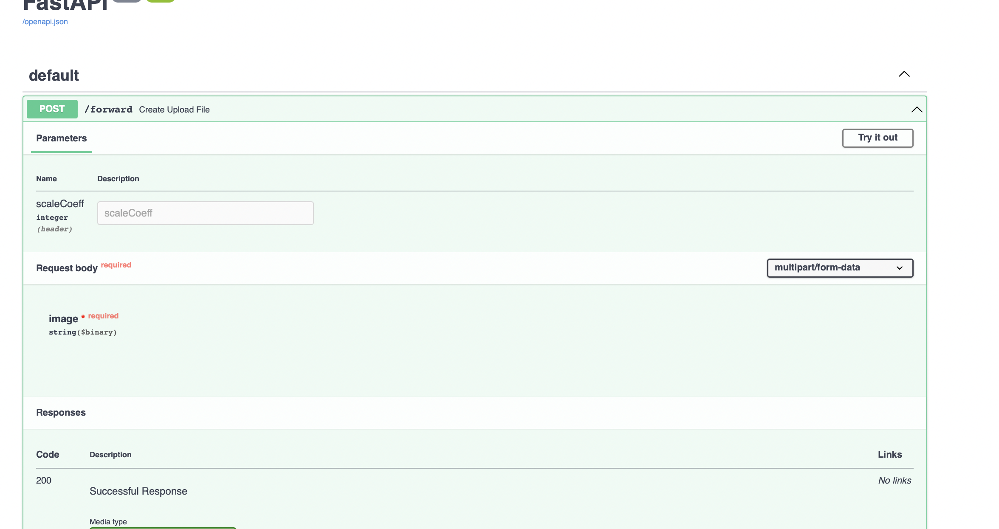

# ml_and_production

This is an implementation of the superresolution with EDSR. 
This application uses FastAPI as a backend framework and Docker as a containerisation. 

To start the application:
* clone this repo `git@github.com:username/ml_and_production.git`
* go to the folder ml_and_production `cd ml_and_production`
* build a docker image `docker build . -t app_image`
* run a docker image `docker run -d --name app -p 80:80 app_image`
* this command will start the app on the 80's port on your machine.
* To upload an image you need to send a post request `http://127.0.0.1:80/forward`
* At the `http://127.0.0.1:80/docs` swagger docs are available
  

* To upload the image you need to set the scaling coefficient in the header scaleCoeff (app supports 2, 3, 4) and the image itself should be send as the multipart body.
* As a result the base64 encoded image is return. 
